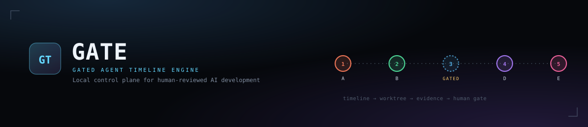
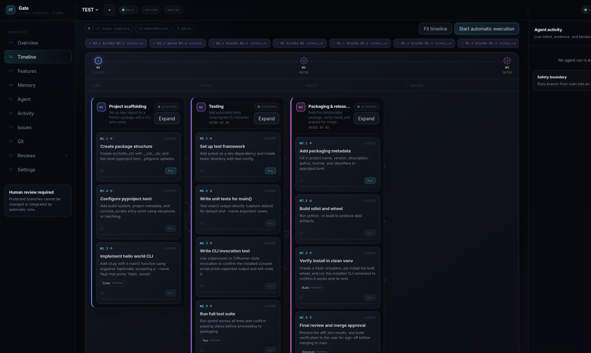

# Gate

Gate is a localhost-first control plane for human-reviewed AI development. You describe a goal in plain language, a local agent (Claude Code, OpenCode, Codex, Gemini CLI, Cursor Agent, or Copilot CLI) proposes a dependency-aware timeline of milestones and steps, you review and accept it, and only then does anything run. Every run happens in its own isolated Git worktree and stops at the first unmet dependency or unapproved gate.

The name is literal. The core domain object is the gate: a checkpoint a step must clear (`code`, `test`, `build`, `plan`, `visual`, or `approval`) before the timeline lets it proceed. An agent can attach evidence to a gate. Only a human can decide it.

Full documentation is published at **[t-crypt.github.io/GATE](https://t-crypt.github.io/GATE)**.



## What it does

**Plans before it acts.** You give Gate a goal and repository context. A local provider returns a graph of milestones and steps with explicit dependencies and gates, not a wall of text. Nothing executes until you accept the draft. The Settings page picks the backend provider per project — Claude Code, OpenCode, Codex, Gemini CLI, Cursor Agent, or Copilot CLI; new projects default to Claude.

**Runs in isolation.** Every accepted step gets its own linked worktree on a branch named with the project's run-branch prefix — `work/gate-<run-id>` by default, and per-project configurable — created from your base branch without ever checking it out or modifying it. Gate refuses to start a run if that base checkout has uncommitted changes.

**Never touches your protected branches.** Connect auto-detects the repository's default branch as the single protected base branch; optional stable and production branches can be added from Settings. Gate will not execute on protected branches, merge into them, push to them, delete them, or rewrite them. There's no merge or integration command anywhere in the app: a human reviews the resulting branch and decides what happens to it, outside Gate entirely.

**Shows the remote picture without writing to it.** With `GATE_GITHUB_TOKEN` set, the Git view observes open pull requests and repository issues over the GitHub API — read-only. Gate never creates, merges, or pushes a branch on your behalf; those actions live outside Gate, with you.

**Ties evidence to a commit.** Gate binds evidence submitted against a gate to a specific commit SHA and file scope. If the branch moves or a file in that scope changes afterward, the evidence goes stale and can no longer satisfy the gate. Approval gates require a decision from a human actor; Gate rejects an agent that tries to approve its own work.

**Records every command as an event.** Each command appends an ordered, immutable event and updates its read model in one transaction. That event stream also drives the live UI over WebSocket. A client that drops and reconnects gets replayed exactly the events it missed, no gaps or duplicates.

**Shows you the whole plan at once.** The timeline view renders a mile-marker rail across the top: one colored badge per milestone, connected by a track, showing which milestones are gating which. A locked marker tells you exactly which upstream milestone is holding it up. Each milestone's lane carries the same color as its marker, so the overview and the detail stay visually tied together.

**Keeps a copy in your repo.** Gate mirrors each project's timeline, issues, and notes into `<repo>/.gate/` as plain JSON and Markdown, refreshed on every change. The mirror is ignored by default — Gate appends a `.gate/` entry to the repository's `.gitignore` when it first connects. Remove that entry if you want this data to travel with the repo instead of living only in Gate's local database.

**Builds local project intelligence.** GATE Memory incrementally indexes repository files, JavaScript-family symbols, imports, references, and searchable source text into SQLite. Its Memory view supports hybrid search, focused graph traversal, and deterministic impact analysis. The Context Compiler turns those results and project instructions into token-budgeted planning or execution capsules with commit- and node-level provenance; stale indexes are rejected rather than silently used.

**Keeps feature work grounded.** Durable Feature workspaces connect intent, structural impact, compiled context, and proposed timeline revisions. Local issues use the same planning path, while milestones can be expanded progressively. Every generated plan stays proposed until it is accepted from the localhost interface.

**Speaks MCP too.** The same application services run over stdio for any MCP client. Read tools cover projects, timelines, runs, reviews, activity, and GATE Memory; idempotent mutations can refresh Memory, compile context, draft or accept timelines, run steps, submit evidence, and maintain local issues and notes. There is deliberately no approval tool and no merge, push, or protected-branch mutation tool over MCP: an agent can report evidence, but it cannot approve its own gate.

## Safety contract

- Binds to `127.0.0.1` by default. No telemetry, no cloud service.
- Never executes on, merges into, pushes, deletes, or rewrites protected branches (the connected default branch, plus any stable/production branches you add in Settings). Remote observation is strictly read-only.
- Agents submit evidence. Only a human actor can approve a gate.
- Every automatic run gets its own branch in a linked worktree, never the base checkout.
- Validation artifacts live under `data/tests/<project-id>/` and stay local.

## Start

Requirements: Node.js 24+, Git, and at least one local provider CLI authenticated — `claude`, `opencode`, `codex`, `gemini`, `cursor-agent`, or `copilot`.

```bash
npm ci
npm start
```

Open `http://127.0.0.1:4177`, connect an existing Git repository, describe a goal, review the proposed timeline, then accept it. Automatic mode starts ready steps on its own but always stops at unmet dependencies and human gates.

Run `npm run dev` for development. `npm run check` is the full release gate (lint, unit, integration, and browser tests). `npm audit --omit=dev` reports production dependency status.

## MCP

Run `npm run mcp` from an MCP client. The server uses stdio and the same SQLite-backed services as the web UI. See [MCP interface](https://t-crypt.github.io/GATE/docs/mcp/).

## Operations

Copy `.env.example` values into your process environment as needed (`GATE_DATA_DIR`, `GATE_JSON_LIMIT`, `GATE_OUTPUT_LIMIT_BYTES`, `HOST`, `PORT`, `LOG_LEVEL`). Set `GATE_GITHUB_TOKEN` (or `GATE_GITHUB_API_URL` for a GitHub Enterprise host) to enable the read-only remote overview in the Git view. The default database is `data/tracker.db`; run worktrees live under `data/worktrees`. Backups go through `BackupService` and never overwrite an existing target. See [setup & operations](https://t-crypt.github.io/GATE/docs/setup/), [architecture](https://t-crypt.github.io/GATE/docs/architecture/), [project intelligence](https://t-crypt.github.io/GATE/docs/project-intelligence/), [providers](https://t-crypt.github.io/GATE/docs/providers/), and [troubleshooting](https://t-crypt.github.io/GATE/docs/troubleshooting/).
